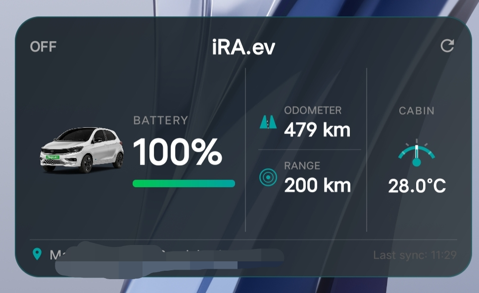

# iRA.ev Widget

> An unofficial Android homescreen widget for Tata Motors EV owners — live vehicle telemetry, right on your homescreen.



---

## What It Does

No more opening the app just to check your battery. **iRA.ev Widget** sits quietly on your homescreen and shows you everything at a glance:

- 🔋 **Battery %** with a live progress bar
- 🛣️ **Range (DTE)** and **Odometer**
- 🌡️ **Cabin Temperature**
- ⚡ **Charging status** with time remaining
- 📍 **Real-time vehicle location** (reverse geocoded to a readable address)
- 🚗 **Vehicle photo** pulled from your Tata account (optional)
- 🔄 **Auto-syncs every 15 minutes** silently in the background

---

## How It Works

The app reverse-engineers the same API endpoints used by the official iRA.ev app. Your credentials are stored securely on-device using Android's `EncryptedSharedPreferences` (AES-256). A background `WorkManager` job wakes up every 15 minutes, refreshes your access token if needed, fetches the latest vehicle state, and updates the widget.

You set it up once. After that it just works.

---

## Setup Guide

### Step 1 — Get Your Credentials

You need to extract 3 values from the iRA.ev API using a traffic interceptor. The easiest way is **HTTP Canary** (Android, no PC needed):

1. Install [HTTP Canary](https://play.google.com/store/apps/details?id=com.guoshi.httpcanary) from the Play Store
2. Start capturing traffic
3. Open the **iRA.ev** app and let it fully load
4. In HTTP Canary, find a request to `evcx.api.tatamotors`
5. Look for the request to `/mobile/cvp/api/v1/ev/vehicle-state`
6. From the **request headers**, copy:
   - `x-api-key` → your API key
   - `vehicleId` → your Vehicle ID
7. Find the request to `/mobile/customer/api/v1/refresh-token`
8. From the **request body**, copy:
   - `refreshToken` → your Refresh Token

### Step 2 — Enter Credentials in the App

1. Open **iRA.ev Widget**
2. Paste your `Refresh Token`, `Vehicle ID`, and `x-api-key`
3. Optionally enable **Show Vehicle Photo** (requires your CRM ID and mobile number)
4. Tap **Test Connection & Save**
5. Done ✅

### Step 3 — Add the Widget

Long press your homescreen → Widgets → find **iRA.ev Widget** → place it (5×2 cells recommended).

---

## Credentials Reference

| Credential | Where to Find It |
|---|---|
| `refreshToken` | Request body of `/mobile/customer/api/v1/refresh-token` |
| `vehicleId` | Request header of any `/mobile/cvp/api/v1/ev/` request |
| `x-api-key` | Request header of any `/mobile/cvp/api/v1/ev/` request |
| `crmId` *(optional)* | Any request header labelled `crmId` |
| `mobile` *(optional)* | Your Tata account mobile number |

---

## Token Management

- Your **refresh token** is stored permanently and never expires unless Tata invalidates your session
- A new **access token** is fetched automatically every ~24 hours using your refresh token
- If your session is ever invalidated (e.g. you log out of iRA.ev or change your password), the widget will show stale data — just re-open the app and re-enter your refresh token

---

## Tech Stack

| Component | Technology |
|---|---|
| Language | Kotlin |
| HTTP Client | OkHttp 4.12 |
| JSON Parsing | Gson 2.10 |
| Background Sync | WorkManager 2.9 |
| Secure Storage | EncryptedSharedPreferences (AES-256-GCM) |
| Geocoding | Android Geocoder + OSM Nominatim fallback |
| Widget | AppWidgetProvider + RemoteViews |

---

## Build & Install

```bash
git clone https://github.com/yourusername/irawidget.git
cd irawidget
./gradlew assembleDebug
adb install app/build/outputs/apk/debug/app-debug.apk
```

Or just download the latest APK from [Releases](../../releases).

---

## Known Limitations

- **Android only** — iOS requires a Mac and Apple Developer account
- **Manual credential setup** — Tata doesn't offer a public API or OAuth, so you need to extract tokens yourself
- **SSL bypass** — The app uses a trust-all certificate validator for the Tata API endpoint
- **No real-time push** — Data refreshes every 15 minutes, not instantly

---

## Disclaimer

This is an **unofficial, community-made app** with no affiliation to Tata Motors. It uses the same API endpoints as the official iRA.ev app. Use at your own risk. The developer is not responsible for any issues arising from API changes, account suspension, or data inaccuracies.

This app does **not** collect, transmit, or store your data anywhere other than your own device.

---

## Contributing

PRs welcome! Some ideas for contributions:
- Lock/unlock remote commands
- Charging schedule support
- Multiple vehicle support
- Notification alerts (low battery, charging complete)
- KWGT data provider integration

---

## License

MIT License — see [LICENSE](LICENSE) for details.

---

*Made with ❤️ by a Tata EV owner, for Tata EV owners.*
